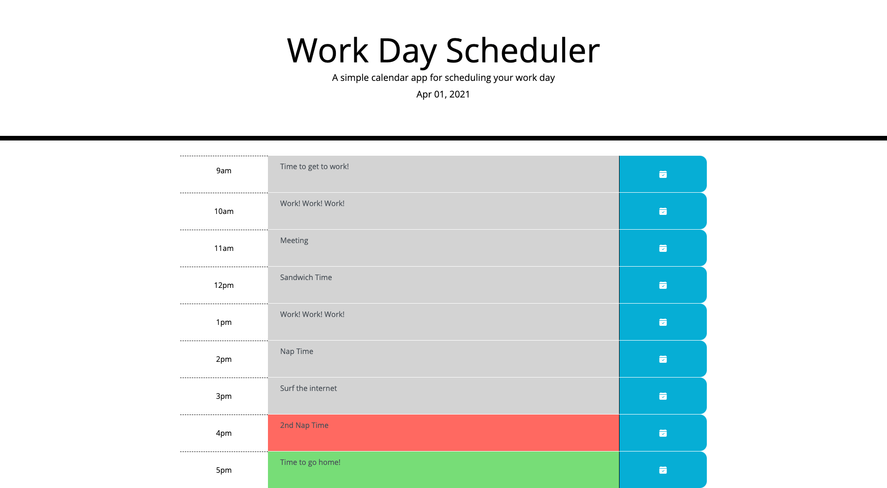

# work-day-scheduler
A simple calendar application that allows a user to save events for each hour of the day.  It's built with HTML, Bootstrap, Bootstrap Icons, CSS, Google Fonts and JavaScript, with Javascript driving the HTML viewable on the page.

## Link to Deployed Application

https://swillrich5.github.io/work-day-scheduler/

## GitHub Repository

https://github.com/swillrich5/work-day-scheduler

## Requirements
As stated, Work Day Scheduler allows the user to enter their schedule for each hour of the work day.  It's implemented in the following way:

* As the application starts, a setInterval() timer is set up to display the curent date in the header.  The timer is updated every second
* At virtually the same time, this timer is also used to color code each row of the schedule:
  * Rows that mark a time of day before the current time have a grey background.
  * The row that represents the current hour has its background set to fuschia.
  * Future row times have a green background.
* As the day goes on, the timer is checked to update the date and the background colors of the hour rows.
* Appointments, meetings, and other descriptions can be entered into each row.  They are saved by clicking the blue "save" buttons, each of which have a click event listener assigned to them.  This is implemented by grabbing each of the row buttons ("querySelectorAll(".button-id")) and setting up the event listener on each element of the array, using a for-each loop.
* Appointments, meetings, etc., are made to persist by writing them out to local storage.
* Bootstrap version 4.5 (https://getbootstrap.com/docs/4.5/getting-started/introduction/) and local css are used to style the application
* moment (https://momentjs.com/docs/#/displaying/) is used to get time and perform calculations.
* Google fonts (https://fonts.google.com/) is used to style the application text.

---

## Application Screenshot

Work Day Scheduler